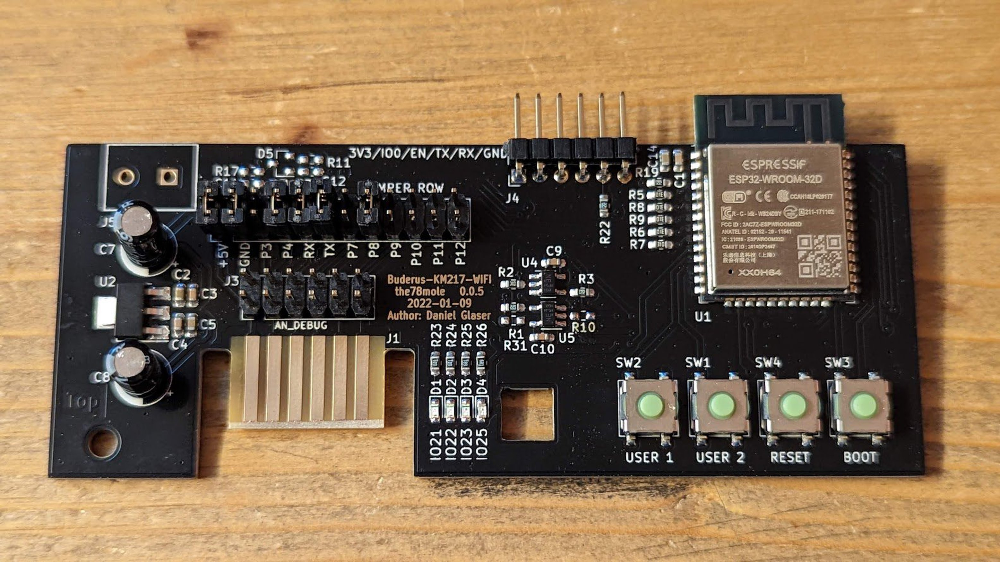
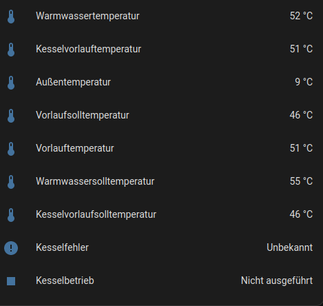
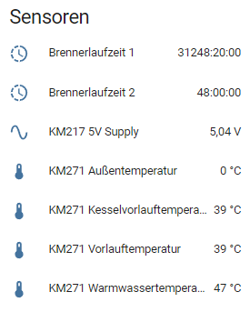
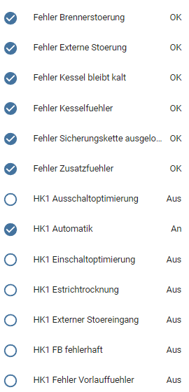

# esphome_components
ESPhome Components from the little digger and Jens

We collected some (currently one) of our ESPhome components here to share with other diggers:

- KM271-WiFi is also described in detail in one of my [blog posts](https://the78mole.de/reverse-engineering-the-buderus-km217/) and it received a [how-to page](https://the78mole.de/projects/km271-wifi-howto/) to take it into action e.g. with the default ESPhome firmware.

You will find some precompiled bin-files to upload to your hardware in the [gh-pages-branch](https://github.com/the78mole/esphome_components/tree/gh-pages).

## KM217 Wifi

### Overview
This component uses the hardware designed by the78mole to read interesting values from a buderus logamatic oil fired heating system (Logamatic 2107 M). We also had reports of gas burning systems, this module fits in and communicates with the controller. 

Here is just a short overview of the information you can get from the logamatic:

 
 
 

 
### Usage
See https://esphome.io/components/external_components.html for information about integrating this into your esphome environemnt.

To configure the component, see the included file buderus-km271.yaml.
If you are not interested in some of the provided values, just remove the respective entry in the the section "sensor" or "binary_sensor", but leave the empty sections in place to avoid comiler errors with missing headers.

#### Writing Values and Changing Parameters 
If you plan to change settings for your heater, see the included file buderus-km271-writable.yaml. This file also provides integration for changing values via home assistant.

*CAUTION*: 
Changing settings of your heater might lead to undesired results, e.g. increased fuel consumption, annoyed family members or even failure of your device.
Please use caution when changing settings of your heater and verify that the results are as desired. Rule of thumb: If you don't feel comfortable changing the settings directly on the heater control unit,
do dot do it via this software either.

*MORE CAUTION*: 
If you plan to change settings, please take care not to change settings too
frequently. Devices such as these heaters typically use so called EEPROM chips to store settings. Such chips only support a certain number of write operations before breaking down.
You should be safe for some years if you don't write more 20 values per day - but there is no guarantee. Maybe someone can dig out some documentation about this to make sure.

### Limitations
   * The software only provides a sub-set of the available data. Feel free to create a pull request to add data you want to see.
   * Changing of values is only supported for a few values
   * Only one write request can be active at the same time
   * Written values are not read back for verification.

### Notes by Jens
I'm working on this project as a hobby. My work on this software is in no way associated with a company. If you like to use it, or improve on it, feel free.
Use it at your own risk - it might work perfectly or it might not.
 
THE SOFTWARE IS PROVIDED "AS IS", WITHOUT WARRANTY OF ANY KIND, EXPRESS OR IMPLIED, INCLUDING BUT NOT LIMITED TO THE WARRANTIES OF MERCHANTABILITY, FITNESS FOR A PARTICULAR PURPOSE AND NONINFRINGEMENT. IN NO EVENT SHALL THE AUTHORS OR COPYRIGHT HOLDERS BE LIABLE FOR ANY CLAIM, DAMAGES OR OTHER LIABILITY, WHETHER IN AN ACTION OF CONTRACT, TORT OR OTHERWISE, ARISING FROM, OUT OF OR IN CONNECTION WITH THE SOFTWARE OR THE USE OR OTHER DEALINGS IN THE SOFTWARE.

### Advertisement by Jens
If you are in need of professional software engineering services, feel free to contact me. I've got good contacts to a ten-person embedded software and server software development team.
They are based in Germany and also provide coaching and support regarding continuous integration and test automation.
